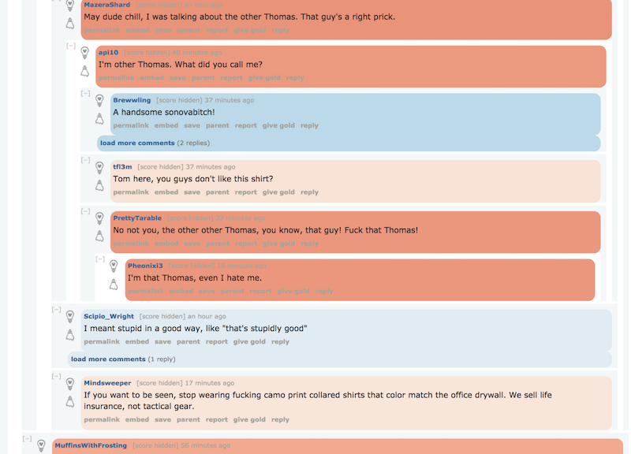
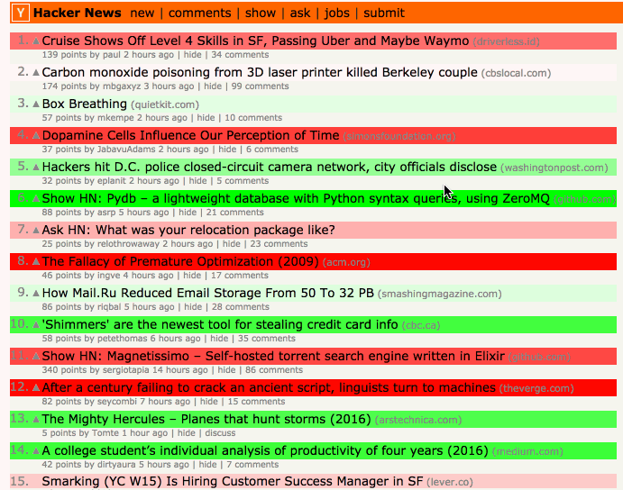
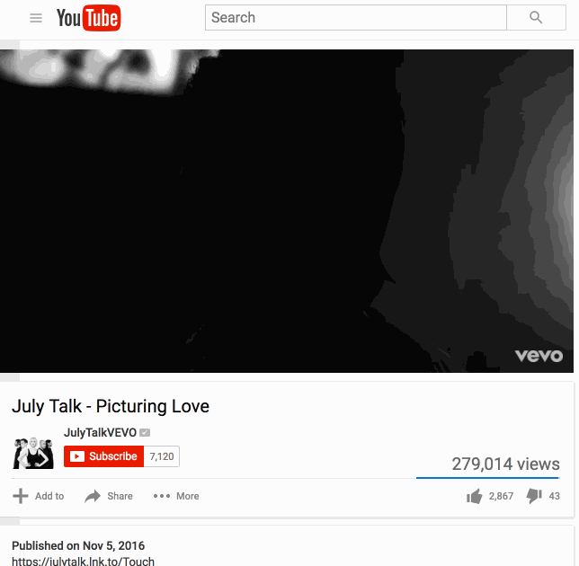
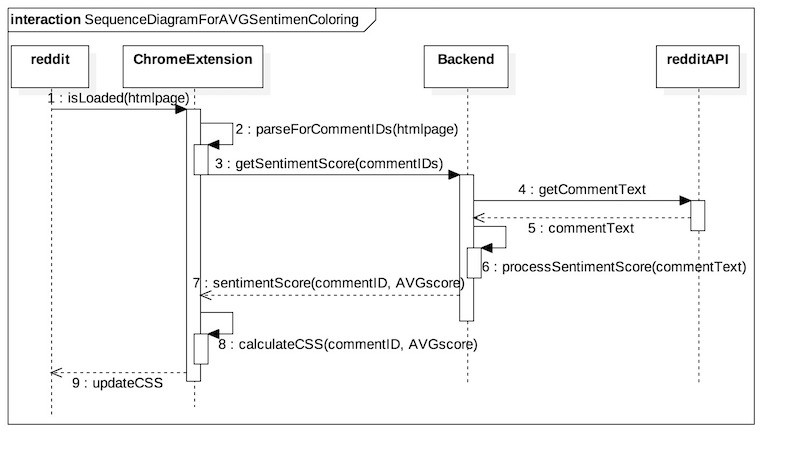

# CommentSentiment

Chrome Extension to highlight the sentiment of posts based on the comments of poster

Companion Server Project:  https://github.com/jipson7/MassiveWaffle

## Demos

#### Reddit

Shows up left of the story

#### HackerNews

#### Youtube

# Technology

* Javascript(D3, Jquery)

# Overall Architecture

# License

[GPL-3.0](LICENSE)
